# Using the Impact++ ODK Central GDS Connector
As of 2/12/2021, our connector is fully functional with both visualizing geographic data on GDS and supporting user viewing their repeat data. Using the following steps, you should be able to get up and running! Feel free to open an issue on this repo if something isn't working, or a comment [here](https://forum.getodk.org/t/create-an-odata-connector-to-use-odk-central-as-data-source-in-google-data-studio/23636/12) if you need help.

Before reading further, please take a moment to consider your privacy concerns and read the blurb below about user data.  

## Accessing the connector
As of 6/14/2021, our connector now is reviewed and published by Google as a official data source that anyone can access
through the Google Data Studio platform!
To access the ODK data connector, go to [Connector Gallery](https://datastudio.google.com/data), and in the
search bar enter "ODK Central". A connector with ODK logo on it will appear. Click on that. You will be
directed to the authentication page. Follow the directions below to use the connector.

(Alternatively, you can just go to the Google Data Studio website, and in your report add "ODK Central" as
a data source.)

## Using the connector

1. Have a form which you've uploaded to your instance of ODK Central, as well as some data you'd like to view in Google Data Studio.
1. Create a Central account which has view-only privileges. This step is not strictly necessary, but Google will [use](https://support.google.com/datastudio/answer/9053467?hl=en) your login information, which users may have varying levels of comfort with.
1. Using the Central account you'd like google to be "aware" of, login to the connector. In the Path text box, please paste the **full** OData URL for your form, as described [here](https://docs.getodk.org/central-submissions/#connecting-to-submission-data-over-odata) (e.g. https://sandbox.getodk.cloud/v1/projects/4/forms/two-repeats.svc)
1. Once you've logged in, there will be a second configuration screen. You will need to copy the URL you entered in the first screen again to the text box in the second screen. Later you can come back to change the URL to another form you want to analyze.
1. Click on NEXT.
1. Now another field should appear that says "Table". (see an example image below)
1. Click on the triangle in the "Table" field and a dropdown menu would appear. Select the repeat/Submissions table you want to access.
1. Click on NEXT.
1. Now you will see the number of rows in this table, and you may configure the starting row and number of rows you want to access. If you have thousands of submissions or less, you can likely pull the full dataset without difficulty. If the number of rows you want to access is around 50,000, it will take a couple minutes to transfer your data and you may want to only pull a subset. (**Note: starting row parameter is 0-indexed. i.e. if you want to access the entire dataset, your start will be 0, and number of rows should be length of dataset.**)
1. Click on CONNECT.
1. Make sure the types of your data are correct. If they are not what you expect, you can manually change them.
1. Create a report and play with your data! Our tutorial ends here. Happy reporting and let us know if you have any feedback!

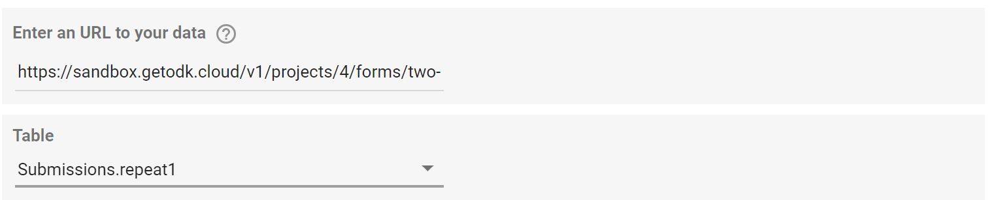

## Blending Data
If you have data in different repeat tables or forms that are related to eachother, you can use the blended data feature of Google Data Studio to create visualizations using both datasets to illustrate their connections. An example of how to do this with different repeat table in the same form follows: 
1. For this example I am using a form that has two repeat tables: a outer club table and an inner person table. The person table has information about people in each club and the club table has information about the club. In this example I will blend the data of these two tables. 
2. Open a connection to either table in GDS (Note you do not need to create a report for the first table)
3. Open a connection to the second table in GDS and create a report from it 
4. Click on the "Blend Data" option in the toolbar on the right 
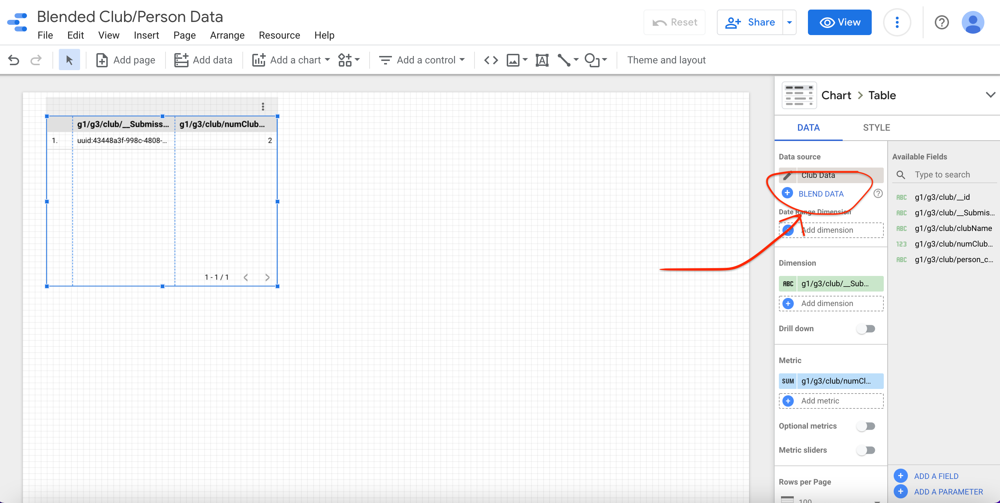
5. Click "Join another table" and select the first connection you opened 
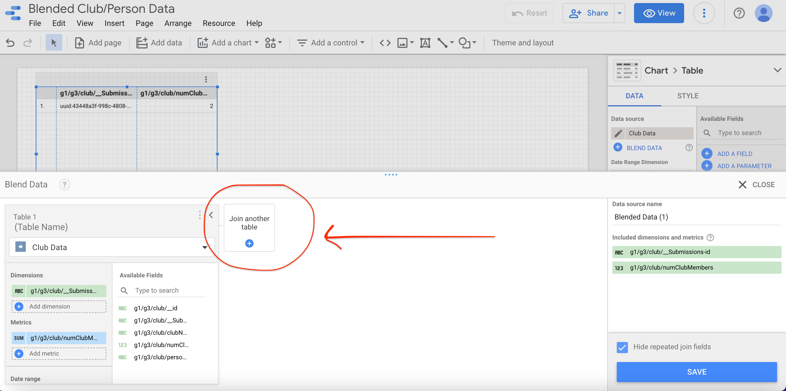
6. Add to "Dimensions" the fields you want to include from both tables
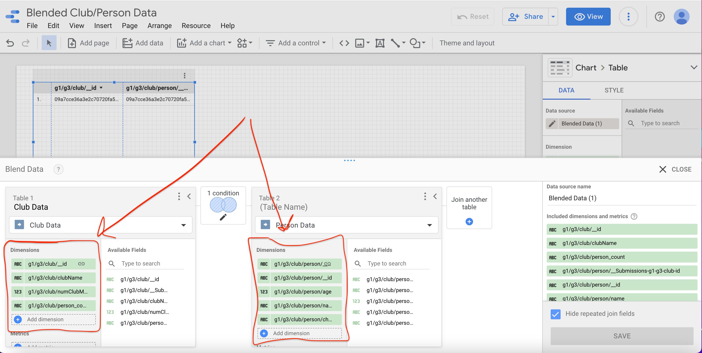
7. You can click configure join to select what type of join you want to do. You also need to specify the fields that connect the two tables 
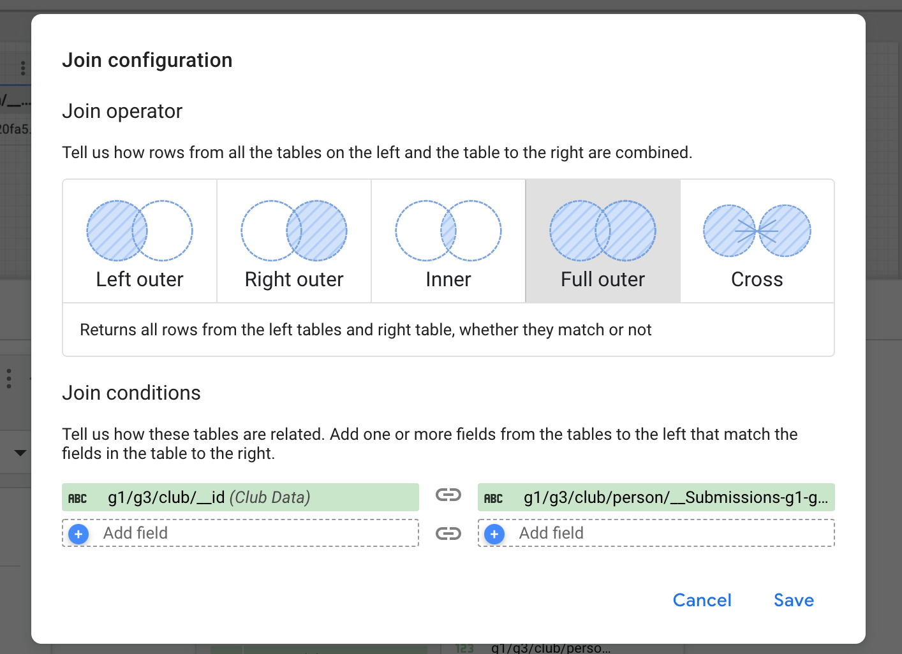
8. Click save and create your report! You can continue to edit the blended data options though! 

## Replacing Connection (Use if going from temporary version of connector to published version) 
1. Create a new connection to your form/table using the connector published on the [GDS connector gallery](https://datastudio.google.com/data?search=ODK)
2. Do not create a report from this connection, instead, go to your existing report and change the data source. 
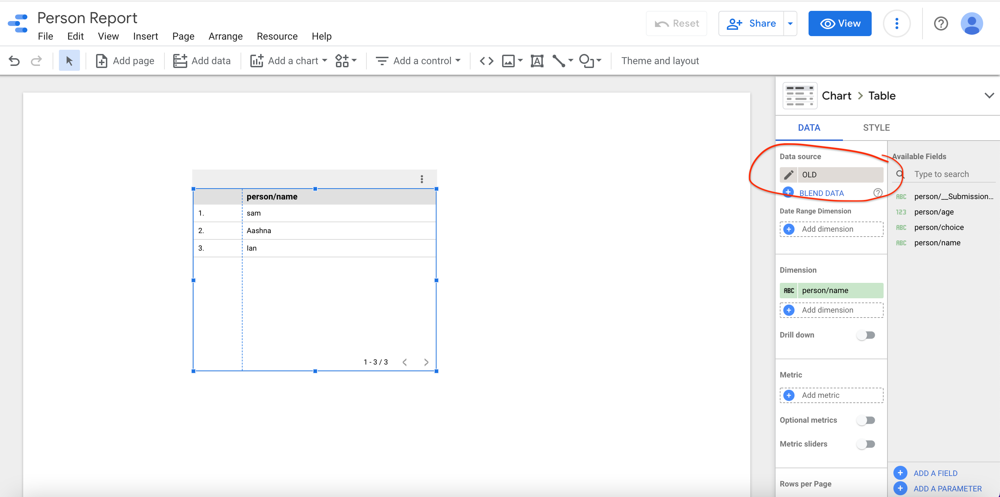
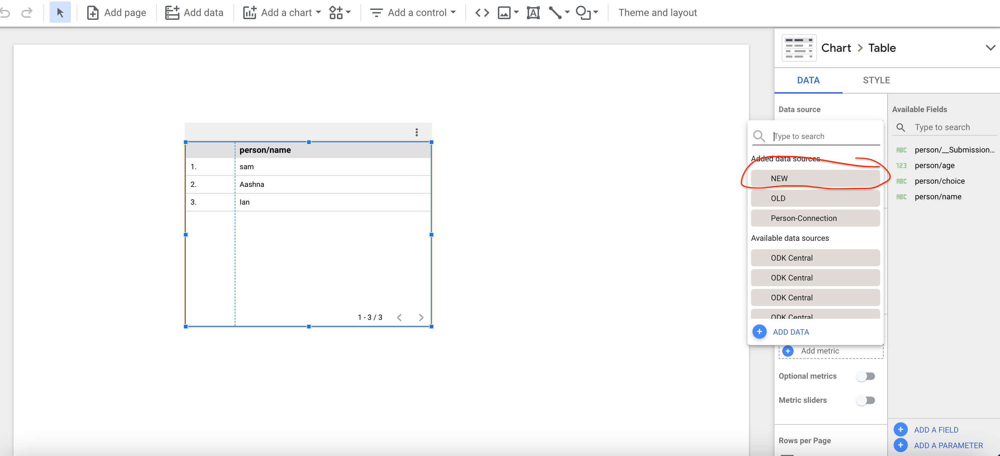
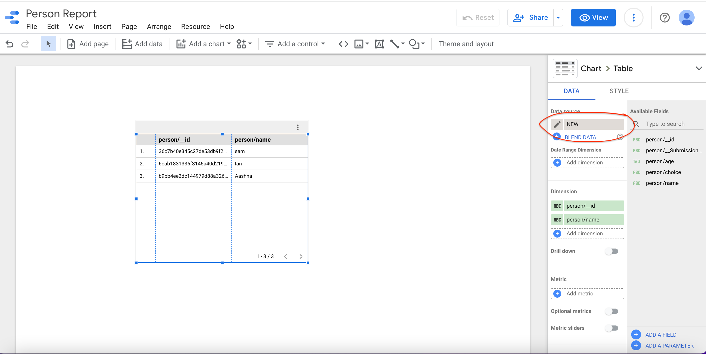
Try refreshing your data if any issues occur. You may have to change some of your fields but let us know if any majors occur! 

## Edit Connection 
We strongly advise **against** editing connections because it may corrupt the original connection and add the wrong data types for the new connection.
If you would like to change the URL or table you are using, we suggest you close your current connector and open a new one (and log out if you intend to connect to an entirely new server).

## Authentication 
To switch the server you are connected to:
1. Open the connector and click the "Reset Auth" checkbox in the upper left corner

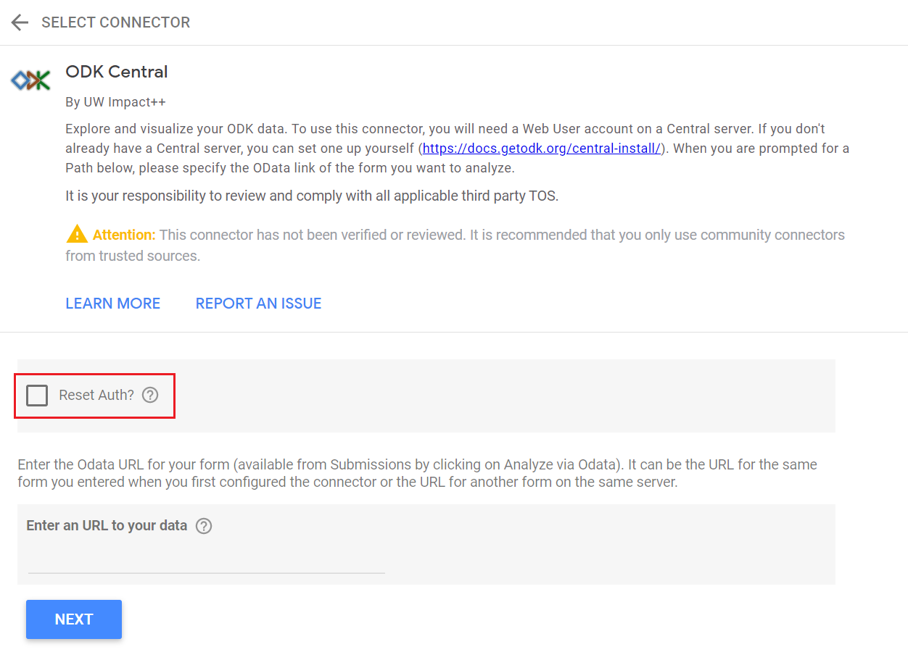

2. Next, refresh your browser window to be led back to the login page where you can input a new server URL and/or email/password.

Note that once you create a GDS report connected to some server, the results of the report will always be viewable. However, when you refresh your data, you may recieve an error stating that you are connected to the wrong server. This means that between the time you created your report and when you are viewing it, you logged into another server. To fix this error, follow the steps above to log out and log in to the correct server. Then refresh your report data once more and it should load properly. 

Whenever you are facing log in issues or see some errors regarding "concat null", it likely means your credentials have expired. Try refreshing your browser window and/or clicking "Refresh Data" in GDS!

## Google Data Studio
We ask that before you use our connector, you take a moment to think about any privacy concerns associated with your data. [GDS](https://developers.google.com/datastudio) is a data visualization tool which is capable of working with any data sources accessible via the internet. There is an [existing ecosystem](https://datastudio.google.com/data) of community connectors, which is where we received our inspiration to create one for ODK Central. When you connect to a data source through a connector, you have to share your credentials for that data source with Google. We recommend creating a Central [Project Viewer](https://docs.getodk.org/central-users/#web-user-roles) specifically to use with GDS.

## Example visualizaing the GEO data
At the Google Data Studio report/exploration page, 
1. Add your geo data field into the *Dimension* column.
2. add another numeric field of your choosing to the *Metric* column.
3. In the chart section of GDS, select "Bubble Map". An map with points on it should appear, like the image below.

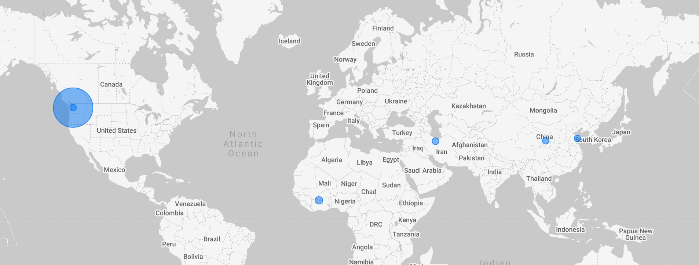

## How to rename your data source
In the first authentication screen or the second configuration screen, at the top left corner of the screen and you should see the name of your connector displayed as "Untitled Data Source", as shown below. If you hover over that and click on the name, it will give you the chance to rename this data source to something more meaningful, for example "odata-my-form".
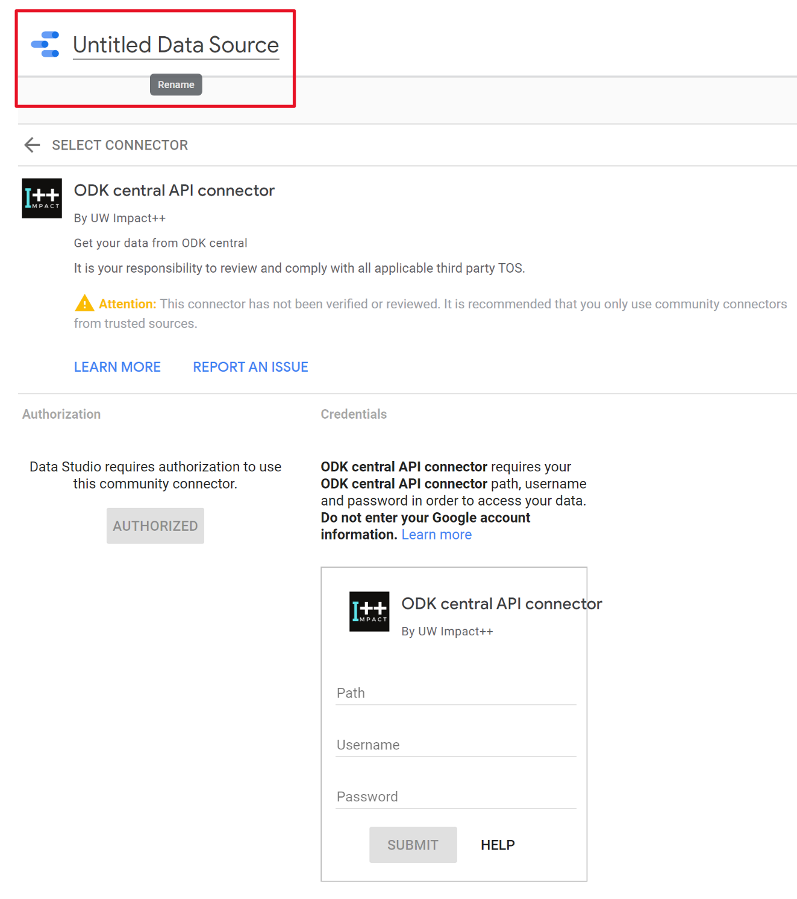

## Converting ODK datatypes to GDS datatypes
Most ODK datatypes have fairly natural GDS equivalents. However, there are some complications when converting certain datatypes, which are documented below.

1. Files attached to ODK submissions (images, videos, pictures, etc.) are represented with a URL that will lead to the file in GDS. Note that because of ODK's authorization requirements, you will be unable to access these files by directly following the link from GDS as GDS doesn't attach the correct headers to the request. However, if you are logged into your ODK account, you will be able to copy and paste the link into a web browser to download the file.
2. ODK's dateTime type is converted to GDS's YEAR_MONTH_DAY_HOUR type, which means that the minutes field is lost.
3. ODK's geopoint type is converted to GDS's LATITUDE_LONGITUDE type. Accuracy field from Odata is added as another numeric column in GDS. Elevation field is lost in GDS.
4. ODK's geoshape and geotrace types are currently converted to a TEXT representation in GDS. This may be changed to a group of associated LATITUDE_LONGITUDE points in the future.

## Performance issues accessing forms with many submissions
There are known performance issues with the connector when accessing upwards of ~50,000 rows of an ODK form. This is caused by overhead related to converting data from the format ODK provides to the format that GDS requires. As a result, requests for over 50,000 rows might take several minutes or fail altogether. To handle this issue, we allow users to specify the max number of rows that they want to access from their dataset, which means that parts of large forms can still be accessed. Users should also consider how requests for many rows of larger forms might impact the performance or bandwidth of the server they are requesting data from.

## For Developers
*Note: Google changes its tools often and you may find that these instructions are out of date. At the time of writing, the [apps script ide](https://workspaceupdates.googleblog.com/2020/12/google-apps-script-ide-better-code-editing.html) had just been updated without including all features needed for GDS connectors, and our guide is designed for what is now called the "legacy" editor. If you need to modify the connector, the specification provided from Google can be found [here](https://developers.google.com/datastudio/connector/build). *  
1. Fork this repository (or get its code in any other way you like)
2. Head to https://www.google.com/script/start/  
3. Click "start scripting" along the top bar
4. Create a new project (along top bar)
5. Copy `main.js` into `code.gs` (along with any changes you have made in your fork)
6. Go to view &rarr; show manifest file &rarr; copy `appscript.json` from our repository
7. change the code however you want. (adding new features, etc)
8. Create a [deployment](https://developers.google.com/datastudio/connector/deploy#create_separate_deployments) - Note that you will need to switch to the legacy editor for this. If you simply want to update instead of create a brand new deployment, click "Edit" on the deployment and select a new version number. The Connector link will automatically pull code from the most recent version. Please refrence our deployment guide below for more detail.
9. Debugging logs can be viewed by going to Views > Logs > App Script Dashboard > No restrictions on the 'Run As'. You can add more logs by adding Logger.log() statements throughout the code. Make sure the debug flag at the top of our code is set to true! 

## Deployment Guide 
Notes: If you archive a deployment in the new Apps Script editor this permanently changes the deployment id which means any dashboard using the connector linked to that deployment will no longer work (Essentially it deletes the deployment). So instead of creating a new deployment and archiving the current one, update the version of the current deployment to be the most recent version of the code. Here are the steps to do that: 
1. After making changes to the code go to Apps Script project 
2. Click on "Use legacy editor"
3. Click on "Publish -> Deploy from manifest"
5. Click "Edit" on the deployment you want to update
6. Change version to ""New" (This updates current deployment but doesn't change the deployment id) 
7. Click "Save"
